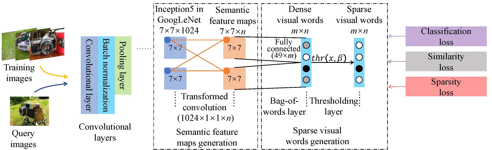

# [E2BoWs: An End-to-End Bag-of-Words Model via Deep Convolutional Neural Network for Image Retrieval](https://www.sciencedirect.com/science/article/pii/S0925231219309105?via%3Dihub)

We provide the source code for paper "E2BoWs: End-to-End Bag-of-Words Model vid Deep Convolutional Neural Network" in [ChinaMM'17](https://arxiv.org/abs/1709.05903). Paper is also accepted by [Neurocomputing](https://www.sciencedirect.com/science/article/pii/S0925231219309105?via%3Dihub). If you find our work helpful, please kindly cite our paper:

@article{E2BoWs,  
  title={E2BoWs: An End-to-End Bag-of-Words Model via Deep Convolutional Neural Network for Image Retrieval},    
  author={Liu, Xiaobin. and Zhang, Shiliang. and Huang, Tiejun. and Tian, Qi.},    
  journal={Neurocomputing},    
  year={2019}
}

We present some new layers such as "ReduceLayer", "SimED2LossLayer" and "ConvReLULayer".

We also present a tool to extract features: "my_extract_features", which writes features in binary files. A set of scripts is presented to read the features and to test the performance. An example of how to use the tools and scripts is shown in folder "CIFAR-10".

Please feel free to contact me if you have any question. 

More details of this project will be released very soon.
